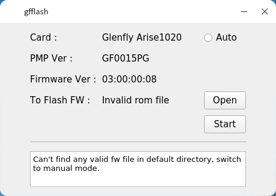

---
title:Arise Tool
description:工具使用说明
tags：usage
---

# Flash Tool

## 功能说明：

​		在Linux环境下，该tool支持对arise1020、arise10c0和arise2030 的Firmware更新。

## 界面说明：

* card ：当前进行flash 设备类型。
* PMP Ver： 当前card原始Firmware中PMP 版本信息。
* Firmware：当前card原始Firmware的版本信息。
* To Flash FW：flash到card的Firmware文件名字。
* auto：是否进行自动flash。
* open：打开文件夹选择需要flash的Firmware文件。
* start：将选择的fileware，flash到当前card。

## 使用说明：

Tool 需要在root权限下进行运行，`sudo ./gfflash` 或者 `./gfflash` 后按提示输入当前系统root 密码。

Tool运行后会默认选择当前文件夹下的高版本Firmware进行自动刷新，若想手动选择，请取消Auto按钮。

Tool会对选择Firmware进行校验，若提示Invalied rom file，请检查选择的file：

* 是否为Firmware文件，以及是否为前card的Firmware；

* 检查选择的Firmware文件版本是否小于当前card的Firmware版本。

**高级模式**

>   使用快捷键`ctrl+alt+m` ，在弹出的输入框中输入`advance` 即可进入高级模式，该模式可以完成对当前card的Firmware版本降级。

**注意事项** ：开始flash后，请耐心等待进度条完成，中途不要关闭软件和电脑，防止card损坏。

## tool 路径：

​       P4V       //sw/s3gdrv/CBIOS/BIOSUTIL/Arise_Tools/gfflash/bin

---

# ROMTool

## 功能说明：

Linux 环境下，该tool完成对arise1020 Firmware 的merge和modify。

## 界面说明：

* Merge 和 Modify ：选择tool 不同功能。
* OutFileName： 手动输入merge后的Fileware 文件名字，会生成对应的.rom文件。
* open：选择需要进行merge的文件，包括PMP、VBIOS和GOP文件。
* FWVersion：输入merge后生成的Firmware文件版本（按照提示格式输入）。
* compress： 是否对merge的GOP文件进行压缩。
* apply：进行merge，生成的文件在当前目录。

* Firmware: 需要更改的Firmware文件。
* PMP、VBIOS、GOP：对上述选择的Firmware文件中的对应的模块进行替换的文件。
* apply： 完成替换，生成文件在当前目录，文件名为${Firmwarename}_modify.rom。

## 使用说明：

* 需要手动输入 merge后文件名字，FW版本信息，以及选择是否压缩GOP。
* 通过Open打开选择文件，PMP和VBIOS只能选择一个文件 ， GOP可以重复打开选择多个不同文件。
* 点击Open**不选择文件** 将会清空已选择的文件。
* modify模式下，可以选择替换PMP，VBIOS和GOP中的一个或多个。
* modify模式下，替换GOP文件需要一个一个平台的进行替换，即一次只能选择一个GOP文件。

## 注意事项：

merge和modify成功会进行弹出提示成功，生成的文件在tool运行目录。

## tool 路径：

​       P4V       //sw/s3gdrv/CBIOS/BIOSUTIL/Arise_Tools/RomTool/bin