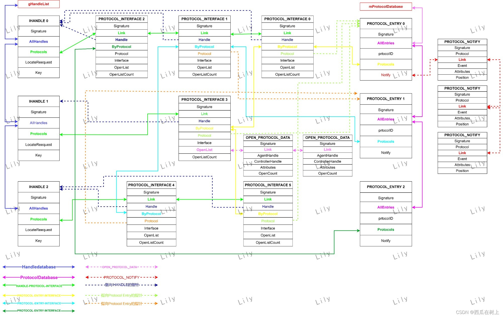

# [refer&teach ](https://github.com/kagurazakakotori/ubmp-cn-code)

# framebuffer base

帧缓冲区（Framebuffer）是系统内存中的一块区域，用于存放待显示图像的像素数据。每个像素的颜色信息由一系列的比特位表示，这些比特位组合起来决定了像素的颜色和透明度。帧缓冲的每个像素地址的计算通常遵循一定的规则，这与以下几个因素相关：

1. **分辨率**：屏幕的分辨率（宽度x高度）决定了总的像素数量。
2. **像素格式**：这决定了每个像素占用多少比特（例如，RGB888表示每个像素由3个8比特组成，分别表示红绿蓝）。
3. **帧缓冲基地址**：这是帧缓冲在物理内存或GPU内存中的起始地址。

在EFI框架下，`GOP`通过其提供的接口允许访问和操作帧缓冲，但它依赖于底层硬件初始化时设置的帧缓冲参数。例如，帧缓冲的起始地址和像素格式等信息往往在系统的EFI配置表中定义，或者由UEFI驱动程序在初始化时配置。

具体到每个像素地址的计算，通常遵循以下公式：

​									**PixelAddress=BaseAddress+(Y×Stride)+(X×BytesPerPixel) **

- `BaseAddress` 是帧缓冲区的起始物理地址。
- `Y` 和 `X` 分别是像素的垂直和水平坐标。
- `Stride` 或称作扫描线长度，是指每行像素在内存中占据的字节数，可能包含额外的填充字节以保证行对齐。
- `BytesPerPixel` 是每个像素占用的字节数，依据像素格式决定。


# Ihandle & protocols

UEFI 系统维护两个全局链表：`gHandleList` `mProtocolDatabase`

**IHANDLE**

```c
//MdeModulePkg\Core\Dxe\Hand\Handle.h
#define EFI_HANDLE_SIGNATURE            SIGNATURE_32('h','n','d','l')

/// IHANDLE - contains a list of protocol handles

typedef struct {
  UINTN               Signature;
  /// All handles list of IHANDLE
  LIST_ENTRY          AllHandles;        			//********************* LINK gHandleList
  /// List of PROTOCOL_INTERFACE's for this handle
  LIST_ENTRY          Protocols;
  UINTN               LocateRequest;
  /// The Handle Database Key value when this handle was last created or modified
  UINT64              Key;
} IHANDLE;
```

**PROTOCOL_ENTRY**

```c
/// PROTOCOL_ENTRY - each different protocol has 1 entry in the protocol
/// database.  Each handler that supports this protocol is listed, along
/// with a list of registered notifies.
///
typedef struct {
  UINTN               Signature;
  /// Link Entry inserted to mProtocolDatabase
  LIST_ENTRY          AllEntries;                  //********************* LINK mProtocolDatabase
  /// ID of the protocol
  EFI_GUID            ProtocolID;
  /// All protocol interfaces
  LIST_ENTRY          Protocols;
  /// Registerd notification handlers
  LIST_ENTRY          Notify;
} PROTOCOL_ENTRY;
```

**PROTOCOL_INTERFACE**

```c
///
/// PROTOCOL_INTERFACE - each protocol installed on a handle is tracked
/// with a protocol interface structure
///
typedef struct {
  UINTN                       Signature;
  /// Link on IHANDLE.Protocols
  LIST_ENTRY                  Link;
  /// Back pointer
  IHANDLE                     *Handle;
  /// Link on PROTOCOL_ENTRY.Protocols
  LIST_ENTRY                  ByProtocol;
  /// The protocol ID
  PROTOCOL_ENTRY              *Protocol;
  /// The interface value
  VOID                        *Interface;
  /// OPEN_PROTOCOL_DATA list
  LIST_ENTRY                  OpenList;
  UINTN                       OpenListCount;

} PROTOCOL_INTERFACE;
```

* 一个`Protocol`实际上是由一个`protocol entry `和 多个`protocol interface`构成的。



**`gBs->InstallProtocolInterface()`**

> 在install一个protocol的时候，首先需要排除当前整个链表中确实不存在待插入的protocol ，确认这一点之后 在从protocol GUID入手 **查找/创建**符合条件的protocol entry 。之后在创建对应的PROTOCOL-INTERFACE结构体 ，**查找/创建**handle结构体，然后将待插入的protocol 实例挂载到PROTOCOL-INTERFACE结构体上，将PROTOCOL-INTERFACE结构体插入整个大的链表网中，最后注册一个protocol的Event,这样才算完全将目标的protocol插入完成。